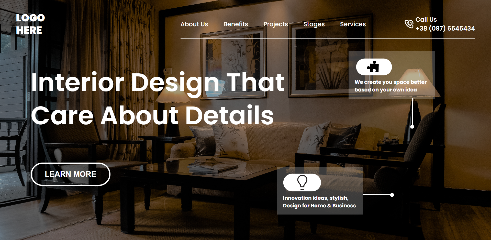

# Interior Design Landing Page

## Project 10 🚀 Website's [Live Link](https://interior-designer-pro.netlify.app/)🔗

>by Arpit Pathak

Screenshot

## What I learned from this Project? 
- Learned to create Semi-transparent color layer over background-image using `::after` pseudo element.
- Learned about the `transform` property `rotate()` for rotating elements.
- Learned to use CSS position (Absolute & Relative) properties.

## Time taken to finish this project ⏳
- 02 hours
-------

