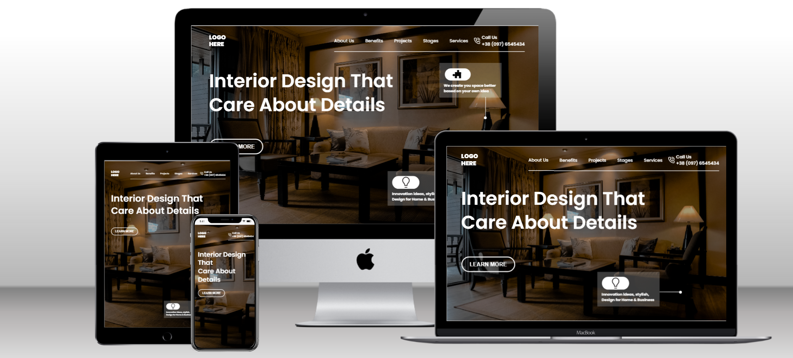

# Interior Design Landing Page

## Project 10 🚀 Website's [Live Link](https://interior-designer-pro.netlify.app/)🔗

>by Arpit Pathak

Screenshot

website on different devices

## 📌 What I learned from this Project? 📝
- Learned to create Semi-transparent color layer over background-image using `::after` pseudo element.
- Learned about the `transform` property `rotate()` for rotating elements.
- Learned to use CSS position (Absolute & Relative) properties.
- Learned about `flexbox` and its properties `justify-content` and `align-items`.
- Learned about media queries for making website responsive.

## 📌 Time taken to finish this project ⏳
- 02 hours + 30 min for making website responsive
-------

